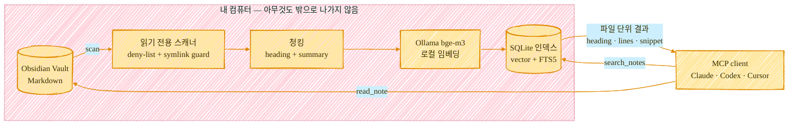

<h1 align="center">Obsidian Semantic Search MCP</h1>

<p align="center">
  agent가 Obsidian Vault에서 필요한 노트를 찾게 해주는 읽기 전용 semantic search MCP.
</p>

<p align="center">
  <a href="https://www.npmjs.com/package/@dalecb/obsidian-semantic-mcp"></a>
  <a href="https://registry.modelcontextprotocol.io/v0.1/servers?search=io.github.DalecB/obsidian-semantic-mcp"></a>
  <a href="./LICENSE"></a>
  
</p>

<p align="center">
  <a href="./README.md">English</a> ·
  <a href="#빠른-시작">빠른 시작</a> ·
  <a href="#왜-이게-필요한가">왜 필요한가</a> ·
  <a href="#동작-방식">동작 방식</a>
</p>

---

Vault에 아무리 잘 정리해둬도, agent가 **필요한 노트**를 못 찾으면 소용이 없습니다.

키워드 검색은 표현이 조금만 달라도 놓칩니다. 쓰기까지 되는 Obsidian MCP 서버는 검색만 하면 되는 agent한테 권한이 과합니다. Obsidian 플러그인은 Obsidian 안에서야 좋지만, Codex·Claude Desktop·Cursor 같은 MCP client에 쥐여줄 안전한 경계로는 애매할 때가 많습니다.

그래서 이 프로젝트는 딱 필요한 만큼만 합니다.

```text
local Obsidian vault -> read-only scanner -> local SQLite index -> MCP search/read tools
```

노트 수정 없음. 클라우드 임베딩 없음. Obsidian plugin runtime 없음. 동기화 서비스 없음.



> 상태: `0.2.0` early preview입니다. 지금 사용할 수 있지만, `1.0` 전까지 ranking과 tool schema는 바뀔 수 있습니다.

## 무엇을 해주는가

| 필요 | 이 서버가 하는 일 |
| --- | --- |
| agent가 읽어야 할 노트 찾기 | Markdown 노트에 semantic + keyword hybrid search 수행 |
| Vault 보호 | search/read/index/status만 제공. write, patch, move, rename, delete tool 없음 |
| local-first 유지 | Ollama 임베딩 사용, 인덱스는 로컬 SQLite에 저장 |
| agent가 바로 쓰기 좋은 결과 | 파일 단위 결과, heading, snippet, line range 반환 |
| Obsidian 상태와 분리 | Obsidian을 켜지 않아도 Vault 파일 시스템에서 직접 읽음 |

결과 예시:

```json
{
  "path": "02_Projects/RealtimeAPI/05_Interview_QA.md",
  "title": "면접 예상 Q&A",
  "score": 0.7431,
  "matched_sections": [
    {
      "heading": "Level 4 > Redis Lua 원자성",
      "lines": [266, 305],
      "reason": "semantic=1, keyword=0.5565, metadata=0.6"
    }
  ]
}
```

## 빠른 시작

요구사항:

- Node.js `>= 24`
- Ollama
- Obsidian Vault
- Codex, Claude Desktop, Cursor 등 stdio MCP client

임베딩 모델 설치:

```bash
ollama pull bge-m3
curl http://localhost:11434/api/tags
```

설정 안내 출력:

```bash
npx -y --package @dalecb/obsidian-semantic-mcp obsidian-semantic-mcp-setup
```

## Codex 설정

`~/.codex/config.toml`에 추가합니다.

```toml
[mcp_servers.obsidian_semantic]
command = "npx"
args = ["-y", "@dalecb/obsidian-semantic-mcp"]

[mcp_servers.obsidian_semantic.env]
OBSIDIAN_VAULT_ROOT = "/path/to/your/Obsidian Vault"
OBSIDIAN_SEMANTIC_MCP_HOME = "/Users/you/.obsidian-semantic-mcp"
OBSIDIAN_EMBED_MODEL = "bge-m3"
OBSIDIAN_SEMANTIC_STARTUP_INDEX = "false"
```

Codex를 재시작한 뒤 실행합니다.

```text
obsidian_semantic.index_status
obsidian_semantic.index_vault { "mode": "incremental" }
obsidian_semantic.search_notes { "query": "라이브 코딩 노트", "limit": 5 }
```

## JSON MCP Client 설정

Claude Desktop, Cursor 등 JSON 설정을 쓰는 MCP client는 아래 형태를 사용합니다.

```json
{
  "mcpServers": {
    "obsidian_semantic": {
      "command": "npx",
      "args": ["-y", "@dalecb/obsidian-semantic-mcp"],
      "env": {
        "OBSIDIAN_VAULT_ROOT": "/path/to/your/Obsidian Vault",
        "OBSIDIAN_SEMANTIC_MCP_HOME": "/Users/you/.obsidian-semantic-mcp",
        "OBSIDIAN_EMBED_MODEL": "bge-m3",
        "OBSIDIAN_SEMANTIC_STARTUP_INDEX": "false"
      }
    }
  }
}
```

## 왜 이게 필요한가

가장 강력한 Obsidian 자동화 서버를 만들 생각은 없습니다. 그보다 agent한테 안심하고 쥐여줄 수 있는 **가장 안전한 검색 도구**를 지향합니다.

보통 같이 후보에 올리는 두 도구 — 풀권한 Obsidian MCP 서버(Local REST API 기반)와 GBrain(더 넓은 지식 컴파일 플랫폼) — 와 한눈에 비교하면:

| | **이 프로젝트** | **풀권한 Obsidian MCP** | **GBrain** |
| --- | --- | --- | --- |
| 접근 모델 | 읽기 전용: search / read / index | 읽기 + 쓰기 + 편집 + 삭제 | 읽기 + 쓰기; 노트를 자체 모델로 컴파일 |
| Vault 수정 | 절대 안 함 | 함 | 함 — 내용을 재구성 |
| Obsidian 실행 필요 | 불필요 — 파일을 직접 읽음 | 필요 — REST API 플러그인 | 불필요 |
| 추가 런타임 | 없음 | Obsidian + 플러그인 | 독립 플랫폼 |
| 임베딩 · 데이터 | 로컬 Ollama; 아무것도 밖으로 안 나감 | 로컬 API; 임베딩은 설정마다 다름 | 자체 파이프라인; 선택적 sync |
| 저장 | 지우고 다시 만들 수 있는 SQLite 파일 하나 | 플러그인이 관리 | 자체 저장소 / 마이그레이션 |
| 적합한 경우 | agent를 위한 작은 읽기 전용 검색 경계 | 전체 Vault 자동화·편집 | 여러 소스를 묶은 컴파일된 지식 베이스 구축 |

의도된 trade-off입니다. 쓰기·편집·Obsidian 실행을 포기한 대신, 구성이 단순하고 문제가 생겨도 영향 범위가 좁습니다.

이런 질문에 맞습니다.

- "이 프로젝트 결정이 어디 노트에 있지?"
- "idempotency payload mismatch 쓴 파일 찾아줘."
- "이 면접 주제와 관련된 커리어 노트를 찾아줘."
- "Vault를 검색하되 절대 수정하지 마."

아래 목적이면 이 서버가 맞지 않습니다.

- Obsidian UI 플러그인
- 자동 노트 생성
- write-capable vault automation
- 대형 vector DB 수준의 확장성

## 제공 도구

### `index_status`

인덱스 상태와 안전 설정을 반환합니다.

### `index_vault`

외부 SQLite 인덱스를 생성하거나 갱신합니다.

```json
{ "mode": "incremental" }
```

특정 파일:

```json
{
  "mode": "incremental",
  "paths": ["02_Projects/My Note.md"]
}
```

### `search_notes`

semantic + keyword hybrid 검색을 수행합니다.

```json
{
  "query": "라이브 코딩 노트",
  "limit": 8,
  "mode": "hybrid"
}
```

검색 모드:

- `hybrid`: semantic vector + SQLite FTS5 + metadata boost
- `semantic`: vector 중심 검색
- `keyword`: query embedding 없이 FTS5 keyword 검색

### `read_note`

Vault 상대 경로로 노트 전체 또는 특정 line range를 읽습니다.

```json
{
  "path": "02_Projects/My Note.md",
  "start_line": 10,
  "end_line": 40
}
```

## 동작 방식

```text
index_vault
  -> OBSIDIAN_VAULT_ROOT 아래 Markdown 파일 스캔
  -> deny path와 symlink escape 차단
  -> Markdown heading 기준 chunking
  -> 파일마다 summary chunk 생성
  -> Ollama bge-m3로 chunk embedding
  -> notes, chunks, FTS row, vector를 SQLite에 저장

search_notes
  -> query를 Ollama로 embedding
  -> vector similarity 계산
  -> SQLite FTS5 keyword match 계산
  -> title/path/heading metadata boost 적용
  -> chunk match를 파일 단위 결과로 재집계
```

기본 저장 위치:

```text
~/.obsidian-semantic-mcp/
  data/semantic.sqlite
  logs/
  cache/
```

Vault는 source of truth입니다. SQLite DB는 언제든 지우고 다시 만들 수 있는 파생 인덱스입니다.

## 안전 모델

이 서버는 Vault를 읽기만 하고 절대 쓰지 않습니다. agent가 무엇을 볼 수 있는지는 세 계층이 결정합니다.

**1. 항상 차단 (시스템 / 도구).** 인덱싱되지 않고 우회 불가:

- `.obsidian/`, `.smart-env/`, `.claude/`, `.codex-*/`
- 모든 hidden 폴더 (이름이 `.`으로 시작)
- `node_modules`, `cache`, `logs`

**2. 민감 — 기본 차단, 해제 가능.** tool call에서 `include_sensitive: true`를 넘겨도 막힙니다. 서버를 `OBSIDIAN_SEMANTIC_ALLOW_SENSITIVE=true`로 실행해야만 해제됩니다. 기본값은 `08_PersonalInfo/`이며, `OBSIDIAN_SEMANTIC_SENSITIVE_PATHS`(쉼표 또는 줄바꿈 구분)로 목록을 재정의할 수 있습니다:

```toml
OBSIDIAN_SEMANTIC_SENSITIVE_PATHS = "08_PersonalInfo, 09_Finance"
```

**3. 사용자 지정 제외 — 항상 차단.** 인덱싱·검색·읽기 모두 막고 싶은 폴더. 해제 플래그 없음:

```toml
OBSIDIAN_SEMANTIC_EXCLUDE = "03_Journal, Private, Clients/Acme"
```

무엇을 골라야 하나?

- **"아예 인덱싱조차 하기 싫다"** → `OBSIDIAN_SEMANTIC_EXCLUDE`
- **"잠가두되, 필요할 때 플래그로 해제하고 싶다"** → `OBSIDIAN_SEMANTIC_SENSITIVE_PATHS` + `OBSIDIAN_SEMANTIC_ALLOW_SENSITIVE`

추가 보호:

- 모든 경로는 `realpath` 기준으로 검증합니다.
- path traversal과 URL-encoded traversal을 차단합니다.
- Vault 밖으로 나가는 symlink를 차단합니다.

> **이 목록 변경은 새 인덱싱에만 적용됩니다.** 이미 인덱싱된 노트는 재인덱싱 전까지 저장된 상태를 유지합니다. `EXCLUDE`나 `SENSITIVE`를 좁힌 뒤에는 `index_vault { "mode": "full" }`을 실행해 `search_notes`가 오래된 결과를 노출하지 않게 하세요. (`read_note`는 항상 현재 설정을 적용합니다.) 적용된 목록은 `index_status`로 확인할 수 있습니다.

SQLite 인덱스에는 snippet과 embedding vector가 저장됩니다. Vault의 파생 복사본으로 취급해야 합니다. 자세한 내용은 [PRIVACY.md](./PRIVACY.md)를 보세요.

## 인덱싱 전략

이 서버는 Vault를 실시간 감시하지 않습니다.

노트를 수정한 뒤에는 아래를 실행합니다.

```json
{ "mode": "incremental" }
```

초기 공개 버전에서는 background watcher보다 명시적 증분 인덱싱이 더 예측 가능합니다. 시작 시 자동 인덱싱을 원하면 아래를 설정합니다.

```toml
OBSIDIAN_SEMANTIC_STARTUP_INDEX = "true"
```

## 개발

```bash
npm test
npm run pack:check
```

배포 전 확인:

```bash
npm pack --dry-run
```

`data/`, `*.sqlite`, 개인 Vault 파일이 포함되지 않았는지 반드시 확인합니다.

## 라이선스

MIT
